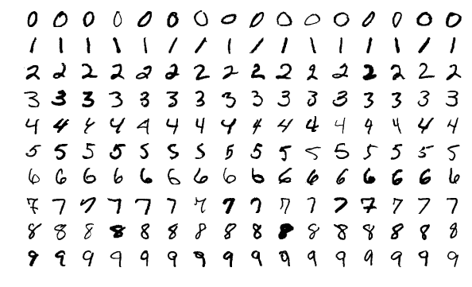
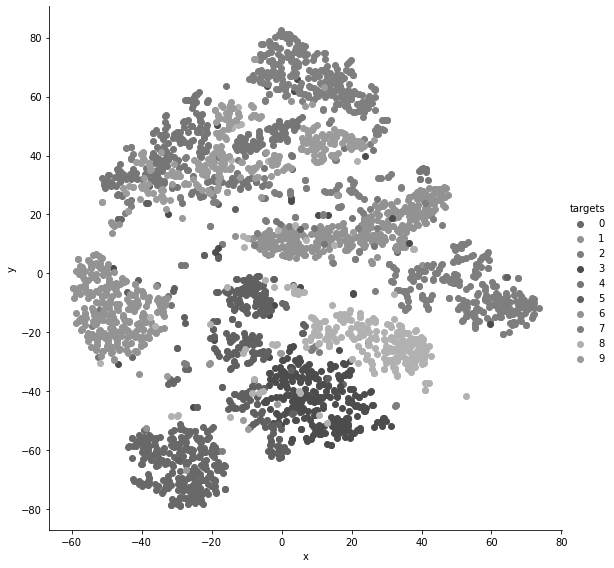
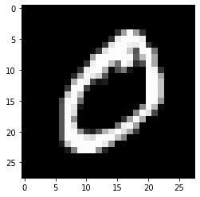
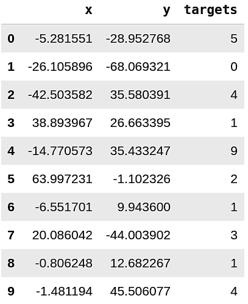

# 无监督和有监督学习

在处理机器学习问题时，通常有两类数据（和机器学习模型）：

- 监督数据：总是有一个或多个与之相关的目标
- 无监督数据：没有任何目标变量。

有监督问题比无监督问题更容易解决。我们需要预测一个值的问题被称为有监督问题。例如，如果问题是根据历史房价预测房价，那么医院、学校或超市的存在，与最近公共交通的距离等特征就是一个有监督的问题。同样，当我们得到猫和狗的图像时，我们事先知道哪些是猫，哪些是狗，如果任务是创建一个模型来预测所提供的图像是猫还是狗，那么这个问题就被认为是有监督的问题。


<p align="center"><b>图 1：有监督学习数据</b> </p>

如图 1 所示，数据的每一行都与一个目标或标签相关联。列是不同的特征，行代表不同的数据点，通常称为样本。示例中的十个样本有十个特征和一个目标变量，目标变量可以是数字或类别。如果目标变量是分类变量，问题就变成了分类问题。如果目标变量是实数，问题就被定义为回归问题。因此，有监督问题可分为两个子类：

- 分类：预测类别，如猫或狗
- 回归：预测值，如房价

必须注意的是，有时我们可能会在分类设置中使用回归，这取决于用于评估的指标。不过，我们稍后会讨论这个问题。

另一种机器学习问题是无监督类型。**无监督**数据集没有与之相关的目标，一般来说，与有监督问题相比，处理无监督数据集更具挑战性。

假设你在一家处理信用卡交易的金融公司工作。每秒钟都有大量数据涌入。唯一的问题是，很难找到一个人来将每笔交易标记为有效交易、真实交易或欺诈交易。当我们没有任何关于交易是欺诈还是真实的信息时，问题就变成了无监督问题。要解决这类问题，我们必须考虑可以将数据分为多少个**聚类**。聚类是解决此类问题的方法之一，但必须注意的是，还有其他几种方法可以应用于无监督问题。对于欺诈检测问题，我们可以说数据可以分为两类（欺诈或真实）。

当我们知道聚类的数量后，就可以使用聚类算法来解决无监督问题。在图 2 中，假设数据分为两类，深色代表欺诈，浅色代表真实交易。然而，在使用聚类方法之前，我们并不知道这些类别。应用聚类算法后，我们应该能够区分这两个假定目标。 为了理解无监督问题，我们还可以使用许多分解技术，如**主成分分析（PCA）、t-分布随机邻域嵌入（t-SNE）**等。

有监督的问题更容易解决，因为它们很容易评估。我们将在接下来的章节中详细介绍评估技术。然而，对无监督算法的结果进行评估具有挑战性，需要大量的人为干预或启发式方法。在本书中，我们将主要关注有监督数据和模型，但这并不意味着我们会忽略无监督数据问题。


<p align="center"><b>图 2：无监督学习数据集</b> </p>

大多数情况下，当人们开始学习数据科学或机器学习时，都会从非常著名的数据集开始，例如泰坦尼克数据集或虹膜数据集，这些都是有监督的问题。在泰坦尼克号数据集中，你必须根据船票等级、性别、年龄等因素预测泰坦尼克号上乘客的存活率。同样，在鸢尾花数据集中，您必须根据萼片宽度、花瓣长度、萼片长度和花瓣宽度等因素预测花的种类。

无监督数据集可能包括用于客户细分的数据集。 例如，您拥有访问您的电子商务网站的客户数据，或者访问商店或商场的客户数据，而您希望将它们细分或聚类为不同的类别。无监督数据集的另一个例子可能包括信用卡欺诈检测或对几张图片进行聚类等。

大多数情况下，还可以将有监督数据集转换为无监督数据集，以查看它们在绘制时的效果。

例如，让我们来看看图 3 中的数据集。图 3 显示的是 MNIST 数据集，这是一个非常流行的手写数字数据集，它是一个有监督的问题，在这个问题中，你会得到数字图像和与之相关的正确标签。你必须建立一个模型，在只提供图像的情况下识别出哪个数字是它。



<p align="center"><b>图 3：MNIST数据集</b> </p>

如果我们对这个数据集进行 t 分布随机邻域嵌入（t-SNE）分解，我们可以看到，只需在图像像素上降维至 2 个维度，就能在一定程度上分离图像。如图 4 所示。



<p align="center"><b>图 4：MNIST 数据集的 t-SNE 可视化。使用了 3000 幅图像。</b> </p>

让我们来看看是如何实现的。首先是导入所有需要的库。

```python
import matplotlib.pyplot as plt
import numpy as np
import pandas as pd
import seaborn as sns
from sklearn import datasets
from sklearn import manifold
%matplotlib inline
```

我们使用 matplotlib 和 seaborn 进行绘图，使用 numpy 处理数值数组，使用 pandas 从数值数组创建数据帧，使用 scikit-learn (sklearn) 获取数据并执行 t-SNE。

导入后，我们需要下载数据并单独读取，或者使用 sklearn 的内置函数来提供 MNIST 数据集。

```python
data = datasets.fetch_openml('mnist_784', version=1, return_X_y=True)
pixel_values, targets = data
targets = targets.astype(int)
```

在这部分代码中，我们使用 sklearn 数据集获取了数据，并获得了一个像素值数组和另一个目标数组。由于目标是字符串类型，我们将其转换为整数。

pixel_values 是一个形状为 70000x784 的二维数组。 共有 70000 张不同的图像，每张图像大小为 28x28 像素。平铺 28x28 后得到 784 个数据点。

我们可以将该数据集中的样本重塑为原来的形状，然后使用 matplotlib 绘制成图表，从而将其可视化。

```python
single_image = pixel_values[1, :].reshape(28, 28)
plt.imshow(single_image, cmap='gray')
```

这段代码将绘制如下图像：



<p align="center"><b>图 5：绘制MNIST数据集单张图片</b> </p>

最重要的一步是在我们获取数据之后。

```python
tsne = manifold.TSNE(n_components=2, random_state=42)
transformed_data = tsne.fit_transform(pixel_values[:3000, :])
```

这一步创建了数据的 t-SNE 变换。我们只使用 2 个维度，因为在二维环境中可以很好地将它们可视化。在本例中，转换后的数据是一个 3000x2 形状的数组（3000 行 2 列）。在数组上调用 pd.DataFrame 可以将这样的数据转换为 pandas 数据帧。

```python
tsne_df = pd.DataFrame(np.column_stack((transformed_data, targets[:3000])),
                       columns=["x", "y", "targets"])
tsne_df.loc[:, "targets"] = tsne_df.targets.astype(int)
```

在这里，我们从一个 numpy 数组创建一个 pandas 数据帧。x 和 y 是 t-SNE 分解的两个维度，target 是实际数字。这样我们就得到了如图 6 所示的数据帧。



<p align="center"><b>图 6：t-SNE后数据前10行</b> </p>

最后，我们可以使用 seaborn 和 matplotlib 绘制它。

```python
grid = sns.FacetGrid(tsne_df, hue="targets", size=8)
grid.map(plt.scatter, "x", "y").add_legend()
```

这是无监督数据集可视化的一种方法。我们还可以在同一数据集上进行 k-means 聚类，看看它在无监督环境下的表现如何。一个经常出现的问题是，如何在 k-means 聚类中找到最佳的簇数。这个问题没有正确答案。你必须通过交叉验证来找到最佳簇数。本书稍后将讨论交叉验证。请注意，上述代码是在 jupyter 笔记本中运行的。

在本书中，我们将使用 jupyter 做一些简单的事情，比如上面的例子和 绘图。对于本书中的大部分内容，我们将使用 python 脚本。您可以使用其他 IDE 因为结果都是一样的。

MNIST 是一个有监督的分类问题，我们把它转换成一个无监督的问题，只是为了检查它是否能带来任何好的结果。如果我们使用分类算法，效果会更好。让我们在接下来的章节中一探究竟。
