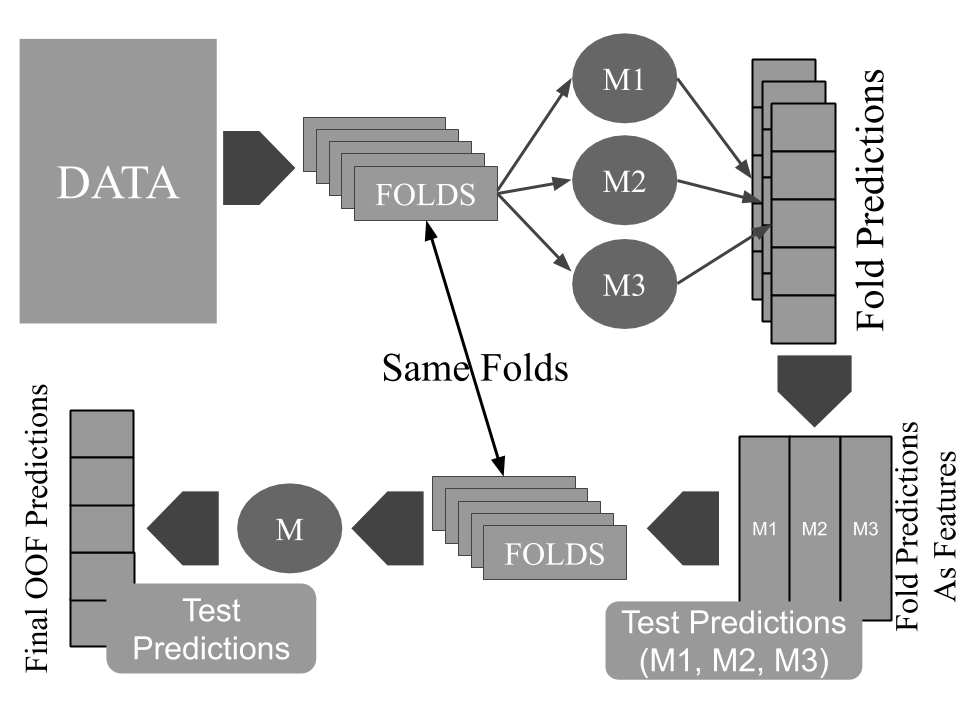

# 组合和堆叠方法

听到上面两个词，我们首先想到的就是在线（online）/离线（offline）机器学习竞赛。几年前是这样，但现在随着计算能力的进步和虚拟实例的廉价，人们甚至开始在行业中使用组合模型（ensemble models）。例如，部署多个神经网络并实时为它们提供服务非常容易，响应时间小于 500 毫秒。有时，一个庞大的神经网络或大型模型也可以被其他几个模型取代，这些模型体积小，性能与大型模型相似，速度却快一倍。如果是这种情况，你会选择哪个（些）模型呢？我个人更倾向于选择多个小机型，它们速度更快，性能与大机型和慢机型相同。请记住，较小的型号也更容易和更快地进行调整。

组合（ensembling）不过是不同模型的组合。模型可以通过预测/概率进行组合。组合模型最简单的方法就是求平均值。
$$
Ensemble Probabilities = (M1\_proba + M2\_proba + ... + Mn\_Proba)/n
$$
这是最简单也是最有效的组合模型的方法。在简单平均法中，所有模型的权重都是相等的。无论采用哪种组合方法，您都应该牢记一点，那就是您应该始终将不同模型的预测/概率组合在一起。简单地说，组合相关性不高的模型比组合相关性很高的模型效果更好。

如果没有概率，也可以组合预测。最简单的方法就是投票。假设我们正在进行多类分类，有三个类别： 0、1 和 2。

[0, 0, 1] : 最高票数： 0

[0, 1, 2] : 最高票级： 无（随机选择一个） 

[2, 2, 2] : 最高票数： 2

以下简单函数可以完成这些简单操作。

```python
import numpy as np
def mean_predictions(probas): 
    # 计算第二个维度（列）每行平均值
    return np.mean(probas, axis=1) 
def max_voting(preds):
    # 沿着第二个维度（列）查找每行中最大值的索引
	idxs = np.argmax(preds, axis=1)
    # 根据索引取出每行中最大值对应的元素
	return np.take_along_axis(preds, idxs[:, None], axis=1)
```

请注意，probas 的每一列都只有一个概率（即二元分类，通常为类别 1）。因此，每一列都是一个新模型。同样，对于 preds，每一列都是来自不同模型的预测值。这两个函数都假设了一个 2 维 numpy 数组。您可以根据自己的需求对其进行修改。例如，您可能有一个 2 维数组，其中包含每个模型的概率。在这种情况下，函数会有一些变化。 另一种组合多个模型的方法是通过它们的**概率排序**。当相关指标是曲线下面积（AUC）时，这种组合方式非常有效，因为 AUC 就是对样本进行排序。

```python
def rank_mean(probas):
    # 创建空列表ranked存储每个类别概率值排名
    ranked = []
    # 遍历概率值每一列（每个类别的概率值）
    for i in range(probas.shape[1]):
        # 当前列概率值排名，rank_data是排名结果
        rank_data = stats.rankdata(probas[:, i]) 
        # 将当前列排名结果添加到ranked列表中
        ranked.append(rank_data)
        # 将ranked列表中排名结果按列堆叠，形成二维数组
        ranked = np.column_stack(ranked) 
    # 沿着第二个维度（列）计算样本排名平均值
    return np.mean(ranked, axis=1)
```

请注意，在 scipy 的 rankdata 中，等级从 1 开始。

为什么这类集合有效？让我们看看图 1。


<p align="center"><b>图 1：三人猜大象的身高</b> </p>

图 1 显示，如果有三个人在猜大象的高度，那么原始高度将非常接近三个人猜测的平均值。我们假设这些人都能猜到非常接近大象原来的高度。接近估计值意味着误差，但如果我们将三个预测值平均，就能将误差降到最低。这就是多个模型平均的主要思想。
$$
Final\ Probabilities = w_1 \times M1\_proba + w_2 \times M2\_proba + \cdots + w_n \times Mn\_proba
$$
其中$(w_1 + w_2 + w_3 + \cdots + w_n)=1.0$

例如，如果你有一个 AUC 非常高的随机森林模型和一个 AUC 稍低的逻辑回归模型，你可以把它们结合起来，随机森林模型占 70%，逻辑回归模型占 30%。那么，我是如何得出这些数字的呢？让我们再添加一个模型，假设现在我们也有一个 xgboost 模型，它的 AUC 比随机森林高。现在，我将把它们结合起来，xgboost：随机森林：逻辑回归的比例为 3:2:1。很简单吧？得出这些数字易如反掌。让我们看看是如何做到的。

假定我们有三只猴子，三只旋钮的数值在 0 和 1 之间。这些猴子转动旋钮，我们计算它们每转到一个数值时的 AUC 分数。最终，猴子们会找到一个能给出最佳 AUC 的组合。没错，这就是随机搜索！在进行这类搜索之前，你必须记住两个最重要的组合规则。

组合的第一条规则是，在开始合奏之前，一定要先创建折叠。

组合的第二条规则是，在开始合奏之前，一定要先创建折叠。

是的。这是最重要的两条规则。第一步是创建折叠。为了简单起见，假设我们将数据分为两部分：折叠 1 和折叠 2。请注意，这样做只是为了简化解释。在实际应用中，您应该创建更多的折叠。

现在，我们在折叠 1 上训练随机森林模型、逻辑回归模型和 xgboost 模型，并在折叠 2 上进行预测。之后，我们在折叠 2 上从头开始训练模型，并在折叠 1 上进行预测。这样，我们就为所有训练数据创建了预测结果。现在，为了合并这些模型，我们将折叠 1 和折叠 1 的所有预测数据合并在一起，然后创建一个优化函数，试图找到最佳权重，以便针对折叠 2 的目标最小化误差或最大化 AUC。因此，我们是用三个模型的预测概率在折叠 1 上训练一个优化模型，然后在折叠 2 上对其进行评估。让我们先来看看我们可以用来找到多个模型的最佳权重，以优化 AUC（或任何类型的预测指标组合）的类。

```python
import numpy as np
from functools import partial
from scipy.optimize import fmin
from sklearn import metrics

class OptimizeAUC: 
    def __init__(self): 
        # 初始化系数
        self.coef_ = 0
    
    def _auc(self, coef, X, y): 
        # 对输入数据乘以系数
        x_coef = X * coef
        # 计算每个样本预测值
        predictions = np.sum(x_coef, axis=1)
        # 计算AUC分数
        auc_score = metrics.roc_auc_score(y, predictions)
        # 返回负AUC以便最小化
        return -1.0 * auc_score
    
    def fit(self, X, y):
        # 创建带有部分参数的目标函数
        loss_partial = partial(self._auc, X=X, y=y)
        # 初始化系数
        initial_coef = np.random.dirichlet(np.ones(X.shape[1]), size=1) 
        # 使用fmin函数优化AUC目标函数，找到最优系数
        self.coef_ = fmin(loss_partial, initial_coef, disp=True) 
        
    def predict(self, X):
        # 对输入数据乘以训练好的系数
        x_coef = X * self.coef_ 
        # 计算每个样本预测值
        predictions = np.sum(x_coef, axis=1) 
        # 返回预测结果
        return predictions
```

让我们来看看如何使用它，并将其与简单平均法进行比较。

```python
import xgboost as xgb
from sklearn.datasets import make_classification
from sklearn import ensemble
from sklearn import linear_model
from sklearn import metrics
from sklearn import model_selection

# 生成一个分类数据集
X, y = make_classification(n_samples=10000, n_features=25) 

# 划分数据集为两个交叉验证折叠
xfold1, xfold2, yfold1, yfold2 = model_selection.train_test_split(X,
                                                                  y,
                                                                  test_size=0.5, 
                                                                  stratify=y)
# 初始化三个不同的分类器
logreg = linear_model.LogisticRegression() 
rf = ensemble.RandomForestClassifier() 
xgbc = xgb.XGBClassifier()

# 使用第一个折叠数据集训练分类器
logreg.fit(xfold1, yfold1) 
rf.fit(xfold1, yfold1) 
xgbc.fit(xfold1, yfold1)

# 对第二个折叠数据集进行预测
pred_logreg = logreg.predict_proba(xfold2)[:, 1]
pred_rf = rf.predict_proba(xfold2)[:, 1]
pred_xgbc = xgbc.predict_proba(xfold2)[:, 1]

# 计算平均预测结果
avg_pred = (pred_logreg + pred_rf + pred_xgbc) / 3 
fold2_preds = np.column_stack((pred_logreg, pred_rf, pred_xgbc, avg_pred))

# 计算每个模型的AUC分数并打印
aucs_fold2 = []
for i in range(fold2_preds.shape[1]):
    auc = metrics.roc_auc_score(yfold2, fold2_preds[:, i]) 
    aucs_fold2.append(auc)
print(f"Fold-2: LR AUC = {aucs_fold2[0]}")
print(f"Fold-2: RF AUC = {aucs_fold2[1]}")
print(f"Fold-2: XGB AUC = {aucs_fold2[2]}")
print(f"Fold-2: Average Pred AUC = {aucs_fold2[3]}")

# 重新初始化分类器
logreg = linear_model.LogisticRegression() 
rf = ensemble.RandomForestClassifier() 
xgbc = xgb.XGBClassifier()

# 使用第二个折叠数据集训练分类器
logreg.fit(xfold2, yfold2) 
rf.fit(xfold2, yfold2) 
xgbc.fit(xfold2, yfold2)

# 对第一个折叠数据集进行预测
pred_logreg = logreg.predict_proba(xfold1)[:, 1]
pred_rf = rf.predict_proba(xfold1)[:, 1]
pred_xgbc = xgbc.predict_proba(xfold1)[:, 1]

# 计算平均预测结果
avg_pred = (pred_logreg + pred_rf + pred_xgbc) / 3 
fold1_preds = np.column_stack((pred_logreg, pred_rf, pred_xgbc, avg_pred))

# 计算每个模型的AUC分数并打印
aucs_fold1 = []
for i in range(fold1_preds.shape[1]):
    auc = metrics.roc_auc_score(yfold1, fold1_preds[:, i]) 
    aucs_fold1.append(auc)
print(f"Fold-1: LR AUC = {aucs_fold1[0]}")
print(f"Fold-1: RF AUC = {aucs_fold1[1]}")
print(f"Fold-1: XGB AUC = {aucs_fold1[2]}")
print(f"Fold-1: Average prediction AUC = {aucs_fold1[3]}")

# 初始化AUC优化器
opt = OptimizeAUC()
# 使用第一个折叠数据集的预测结果来训练优化器
opt.fit(fold1_preds[:, :-1], yfold1)
# 使用优化器对第二个折叠数据集的预测结果进行优化
opt_preds_fold2 = opt.predict(fold2_preds[:, :-1]) 
auc = metrics.roc_auc_score(yfold2, opt_preds_fold2) 
print(f"Optimized AUC, Fold 2 = {auc}")
print(f"Coefficients = {opt.coef_}")

# 初始化AUC优化器
opt = OptimizeAUC()
# 使用第二个折叠数据集的预测结果来
opt.fit(fold2_preds[:, :-1], yfold2)
# 使用优化器对第一个折叠数据集的预测结果进行优化
opt_preds_fold1 = opt.predict(fold1_preds[:, :-1]) 
auc = metrics.roc_auc_score(yfold1, opt_preds_fold1) 
print(f"Optimized AUC, Fold 1 = {auc}")
print(f"Coefficients = {opt.coef_}")
```

让我们看一下输出：

```python
❯ python auc_opt.py
Fold-2: LR AUC = 0.9145446769443348
Fold-2: RF AUC = 0.9269918948683287
Fold-2: XGB AUC = 0.9302436595508696
Fold-2: Average Pred AUC = 0.927701495890154
Fold-1: LR AUC = 0.9050872233256017
Fold-1: RF AUC = 0.9179382818311258
Fold-1: XGB AUC = 0.9195837242005629
Fold-1: Average prediction AUC = 0.9189669233123695
Optimization terminated successfully.
Current function value: -0.920643 
Iterations: 50
Function evaluations: 109
Optimized AUC, Fold 2 = 0.9305386199756128 
Coefficients = [-0.00188194 0.19328336 0.35891836]
Optimization terminated successfully.
Current function value: -0.931232 
Iterations: 56
Function evaluations: 113
Optimized AUC, Fold 1 = 0.9192523637234037 
Coefficients = [-0.15655124 0.22393151 0.58711366]
```

我们看到，平均值更好，但使用优化器找到阈值更好！有时，平均值是最好的选择。正如你所看到的，系数加起来并没有达到 1.0，但这没关系，因为我们要处理的是 AUC，而 AUC 只关心等级。

即使随机森林也是一个集合模型。随机森林只是许多简单决策树的组合。随机森林属于集合模型的一种，也就是俗称的**"bagging"**。在袋集模型中，我们创建小数据子集并训练多个简单模型。最终结果由所有这些小模型的预测结果（如平均值）组合而成。

我们使用的 xgboost 模型也是一个集合模型。所有梯度提升模型都是集合模型，统称为**提升模型（boosting models）**。提升模型的工作原理与装袋模型类似，不同之处在于提升模型中的连续模型是根据误差残差训练的，并倾向于最小化前面模型的误差。这样，提升模型就能完美地学习数据，因此容易出现过拟合。

到目前为止，我们看到的代码片段只考虑了一列。但情况并非总是如此，很多时候您需要处理多列预测。例如，您可能会遇到从多个类别中预测一个类别的问题，即多类分类问题。对于多类分类问题，你可以很容易地选择投票方法。但投票法并不总是最佳方法。如果要组合概率，就会有一个二维数组，而不是像我们之前优化 AUC 时的向量。如果有多个类别，可以尝试优化对数损失（或其他与业务相关的指标）。 要进行组合，可以在拟合函数 (X) 中使用 numpy 数组列表而不是 numpy 数组，随后还需要更改优化器和预测函数。我就把它作为一个练习留给大家吧。

现在，我们可以进入下一个有趣的话题，这个话题相当流行，被称为**堆叠**。图 2 展示了如何堆叠模型。



<p align="center"><b>图2 : Stacking</b> </p>

堆叠不像制造火箭。它简单明了。如果您进行了正确的交叉验证，并在整个建模过程中保持折叠不变，那么就不会出现任何过度贴合的情况。

让我用简单的要点向你描述一下这个想法。
- 将训练数据分成若干折叠。
- 训练一堆模型： M1、M2.....Mn。
- 创建完整的训练预测（使用非折叠训练），并使用所有这些模型进行测试预测。
- 直到这里是第 1 层 (L1)。
- 将这些模型的折叠预测作为另一个模型的特征。这就是二级模型（L2）。
- 使用与之前相同的折叠来训练这个 L2 模型。
- 现在，在训练集和测试集上创建 OOF（折叠外）预测。
- 现在您就有了训练数据的 L2 预测和最终测试集预测。

您可以不断重复 L1 部分，也可以创建任意多的层次。

有时，你还会遇到一个叫混合的术语**blending**。如果你遇到了，不用太担心。它只不过是用一个保留组来堆叠，而不是多重折叠。必须指出的是，我在本章中所描述的内容可以应用于任何类型的问题：分类、回归、多标签分类等。
