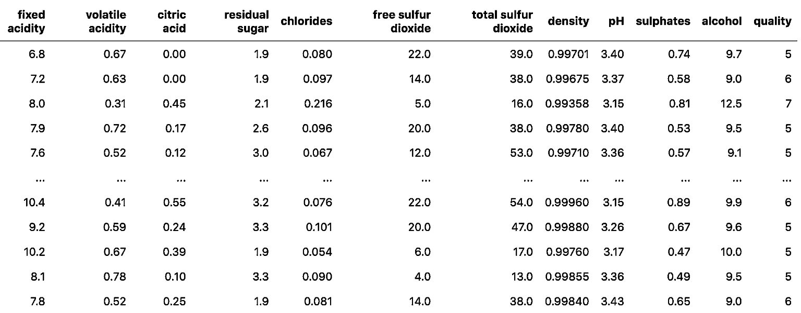
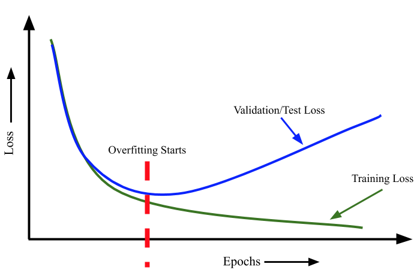
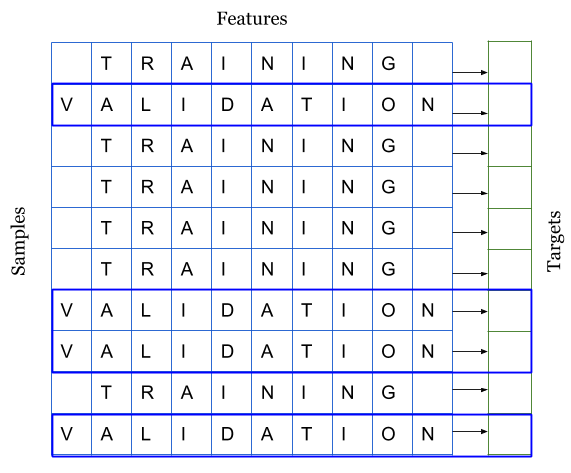
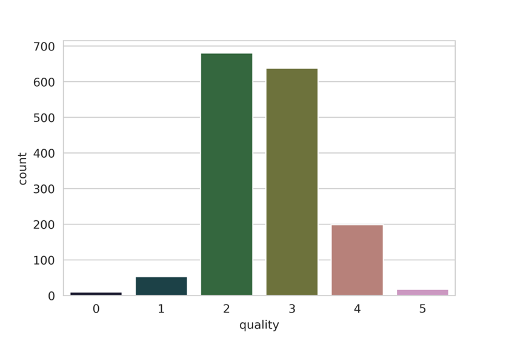
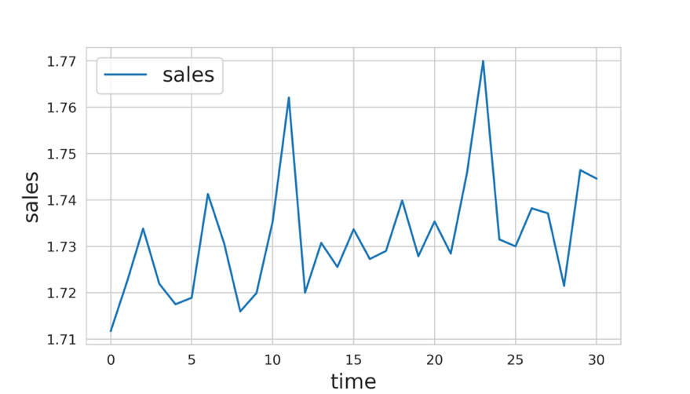
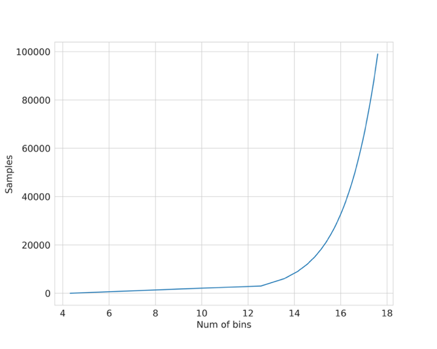

# 交叉检验

在上一章中，我们没有建立任何模型。原因很简单，在创建任何一种机器学习模型之前，我们必须知道什么是交叉检验，以及如何根据数据集选择最佳交叉检验数据集。

那么，什么是**交叉检验**，我们为什么要关注它？

关于什么是交叉检验，我们可以找到多种定义。我的定义只有一句话：交叉检验是构建机器学习模型过程中的一个步骤，它可以帮助我们确保模型准确拟合数据，同时确保我们不会过拟合。但这又引出了另一个词：**过拟合**。

要解释过拟合，我认为最好先看一个数据集。有一个相当有名的红酒质量数据集（**red wine quality dataset**）。这个数据集有 11 个不同的特征，这些特征决定了红酒的质量。

这些属性包括：

- 固定酸度（fixed acidity）
- 挥发性酸度（volatile acidity）
- 柠檬酸（citric acid）
- 残留糖（residual sugar）
- 氯化物（chlorides）
- 游离二氧化硫（free sulfur dioxide）
- 二氧化硫总量（total sulfur dioxide）
- 密度（density）
- PH 值（pH）
- 硫酸盐（sulphates）
- 酒精（alcohol）

根据这些不同特征，我们需要预测红葡萄酒的质量，质量值介于 0 到 10 之间。

让我们看看这些数据是怎样的。

```python
import pandas as pd
df = pd.read_csv("winequality-red.csv")
```



<p align="center"><b>图 1:红葡萄酒质量数据集简单展示</b> </p>

我们可以将这个问题视为分类问题，也可以视为回归问题。为了简单起见，我们选择分类。然而，这个数据集值包含 6 种质量值。因此，我们将所有质量值映射到 0 到 5 之间。

```python
quality_mapping = {
    3: 0,
    4: 1,
    5: 2,
    6: 3,
    7: 4,
    8: 5
}
df.loc[:, "quality"] = df.quality.map(quality_mapping)
```

当我们看大这些数据并将其视为一个分类问题时，我们脑海中会浮现出很多可以应用的算法，也许，我们可以使用神经网络。但是，如果我们从一开始就深入研究神经网络，那就有点牵强了。所以，让我们从简单的、我们也能可视化的东西开始：决策树。

在开始了解什么是过拟合之前，我们先将数据分为两部分。这个数据集有 1599 个样本。我们保留 1000 个样本用于训练，599 个样本作为一个单独的集合。

以下代码可以轻松完成划分：

```python
df = df.sample(frac=1).reset_index(drop=True)

df_train = df.head(1000)
df_test = df.tail(599)
```

现在，我们将在训练集上使用 scikit-learn 训练一个决策树模型。

```python
from sklearn import tree
from sklearn import metrics

clf = tree.DecisionTreeClassifier(max_depth=3)

cols = ['fixed acidity',
        'volatile acidity',
        'citric acid',
        'residual sugar',
        'chlorides',
        'free sulfur dioxide',
        'total sulfur dioxide',
        'density',
        'pH',
        'sulphates',
        'alcohol']

clf.fit(df_train[cols], df_train.quality)
```

请注意，我将决策树分类器的最大深度（max_depth）设为 3。该模型的所有其他参数均保持默认值。现在，我们在训练集和测试集上测试该模型的准确性：

```python
train_predictions = clf.predict(df_train[cols])

test_predictions = clf.predict(df_test[cols])

train_accuracy = metrics.accuracy_score(
    df_train.quality, train_predictions
)

test_accuracy = metrics.accuracy_score(
    df_test.quality, test_predictions
)
```

训练和测试的准确率分别为 58.9%和 54.25%。现在，我们将最大深度（max_depth）增加到 7，并重复上述过程。这样，训练准确率为 76.6%，测试准确率为 57.3%。在这里，我们使用准确率，主要是因为它是最直接的指标。对于这个问题来说，它可能不是最好的指标。我们可以根据最大深度（max_depth）的不同值来计算这些准确率，并绘制曲线图。

```python
from sklearn import tree
from sklearn import metrics
import matplotlib
import matplotlib.pyplot as plt
import seaborn as sns
matplotlib.rc('xtick', labelsize=20)
matplotlib.rc('ytick', labelsize=20)
%matplotlib inline
train_accuracies = [0.5]
test_accuracies = [0.5]
for depth in range(1, 25):
    clf = tree.DecisionTreeClassifier(max_depth=depth)
    cols = [
        'fixed acidity',
        'volatile acidity',
        'citric acid',
        'residual sugar',
        'chlorides',
        'free sulfur dioxide',
        'total sulfur dioxide',
        'density',
        'pH',
        'sulphates',
        'alcohol'
    ]
    clf.fit(df_train[cols], df_train.quality)
    train_predictions = clf.predict(df_train[cols])
    test_predictions = clf.predict(df_test[cols])

    train_accuracy = metrics.accuracy_score(
        df_train.quality, train_predictions
    )
    test_accuracy = metrics.accuracy_score(
        df_test.quality, test_predictions
    )
    train_accuracies.append(train_accuracy)
    test_accuracies.append(test_accuracy)

plt.figure(figsize=(10, 5))
sns.set_style("whitegrid")
plt.plot(train_accuracies, label="train accuracy")
plt.plot(test_accuracies, label="test accuracy")
plt.legend(loc="upper left", prop={'size': 15})
plt.xticks(range(0, 26, 5))
plt.xlabel("max_depth", size=20)
plt.ylabel("accuracy", size=20)
plt.show()
```

这将生成如图 2 所示的曲线图。


<p align="center"><b>图 2：不同 max_depth 训练和测试准确率。</b> </p>

我们可以看到，当最大深度（max_depth）的值为 14 时，测试数据的得分最高。随着我们不断增加这个参数的值，测试准确率会保持不变或变差，但训练准确率会不断提高。这说明，随着最大深度（max_depth）的增加，决策树模型对训练数据的学习效果越来越好，但测试数据的性能却丝毫没有提高。

**这就是所谓的过拟合**。

模型在训练集上完全拟合，而在测试集上却表现不佳。这意味着模型可以很好地学习训练数据，但无法泛化到未见过的样本上。在上面的数据集中，我们可以建立一个最大深度（max_depth）非常高的模型，它在训练数据上会有出色的结果，但这种模型并不实用，因为它在真实世界的样本或实时数据上不会提供类似的结果。

有人可能会说，这种方法并没有过拟合，因为测试集的准确率基本保持不变。过拟合的另一个定义是，当我们不断提高训练损失时，测试损失也在增加。这种情况在神经网络中非常常见。

每当我们训练一个神经网络时，都必须在训练期间监控训练集和测试集的损失。如果我们有一个非常大的网络来处理一个非常小的数据集（即样本数非常少），我们就会观察到，随着我们不断训练，训练集和测试集的损失都会减少。但是，在某个时刻，测试损失会达到最小值，之后，即使训练损失进一步减少，测试损失也会开始增加。我们必须在验证损失达到最小值时停止训练。

**这是对过拟合最常见的解释**。

奥卡姆剃刀用简单的话说，就是不要试图把可以用简单得多的方法解决的事情复杂化。换句话说，最简单的解决方案就是最具通用性的解决方案。一般来说，只要你的模型不符合奥卡姆剃刀原则，就很可能是过拟合。



<p align="center"><b>图 3：过拟合的最一般定义</b> </p>

现在我们可以回到交叉检验。

在解释过拟合时，我决定将数据分为两部分。我在其中一部分上训练模型，然后在另一部分上检查其性能。这也是交叉检验的一种，通常被称为 "暂留集"（**hold-out set**）。当我们拥有大量数据，而模型推理是一个耗时的过程时，我们就会使用这种（交叉）验证。

交叉检验有许多不同的方法，它是建立一个良好的机器学习模型的最关键步骤。**选择正确的交叉检验**取决于所处理的数据集，在一个数据集上适用的交叉检验也可能不适用于其他数据集。不过，有几种类型的交叉检验技术最为流行和广泛使用。

其中包括：

- k 折交叉检验
- 分层 k 折交叉检验
- 暂留交叉检验
- 留一交叉检验
- 分组 k 折交叉检验

交叉检验是将训练数据分层几个部分，我们在其中一部分上训练模型，然后在其余部分上进行测试。请看图 4。



<p align="center"><b>图 4：将数据集拆分为训练集和验证集</b> </p>

图 4 和图 5 说明，当你得到一个数据集来构建机器学习模型时，你会把它们分成**两个不同的集：训练集和验证集**。很多人还会将其分成第三组，称之为测试集。不过，我们将只使用两个集。如你所见，我们将样本和与之相关的目标进行了划分。我们可以将数据分为 k 个互不关联的不同集合。这就是所谓的 **k 折交叉检验**。


<p align="center"><b>图 5：K 折交叉检验</b> </p>

我们可以使用 scikit-learn 中的 KFold 将任何数据分割成 k 个相等的部分。每个样本分配一个从 0 到 k-1 的值。

```python
import pandas as pd
from sklearn import model_selection

if __name__ == "__main__":
    df = pd.read_csv("train.csv")
    df["kfold"] = -1  # 添加一个新列 'kfold' 并设置所有值为 -1
    # 随机打乱数据的顺序
    df = df.sample(frac=1).reset_index(drop=True)
    # 初始化 KFold 类，设置 n_splits=5 进行5折交叉验证
    kf = model_selection.KFold(n_splits=5)
    # 使用 kf.split(X=df) 方法进行数据分割，得到每一折的训练和验证数据的索引
    for fold, (trn_, val_) in enumerate(kf.split(X=df)):
        # 使用验证数据的索引设置 'kfold' 列中相应的折数
        df.loc[val_, 'kfold'] = fold
    df.to_csv("train_folds.csv", index=False)

```

几乎所有类型的数据集都可以使用此流程。例如，当数据图像时，您可以创建一个包含图像 ID、图像位置和图像标签的 CSV，然后使用上述流程。

另一种重要的交叉检验类型是**分层 k 折交叉检验**。如果你有一个偏斜的二元分类数据集，其中正样本占 90%，负样本只占 10%，那么你就不应该使用随机 k 折交叉。对这样的数据集使用简单的 k 折交叉检验可能会导致折叠样本全部为负样本。在这种情况下，我们更倾向于使用分层 k 折交叉检验。分层 k 折交叉检验可以保持每个折中标签的比例不变。因此，在每个折叠中，都会有相同的 90% 正样本和 10% 负样本。因此，无论您选择什么指标进行评估，都会在所有折叠中得到相似的结果。

修改创建 k 折交叉检验的代码以创建分层 k 折交叉检验也很容易。我们只需将 model_selection.KFold 更改为 model_selection.StratifiedKFold ，并在 kf.split(...) 函数中指定要分层的目标列。我们假设 CSV 数据集有一列名为 "target" ，并且是一个分类问题。

```python
import pandas as pd
from sklearn import model_selection
if __name__ == "__main__":
    df = pd.read_csv("train.csv")
    df["kfold"] = -1
    df = df.sample(frac=1).reset_index(drop=True)
    y = df.target.values
    kf = model_selection.StratifiedKFold(n_splits=5)
    for f, (t_, v_) in enumerate(kf.split(X=df, y=y)):
        df.loc[v_, 'kfold'] = f
        df.to_csv("train_folds.csv", index=False)
```

对于葡萄酒数据集，我们来看看标签的分布情况。

```python
b = sns.countplot(x='quality', data=df)
b.set_xlabel("quality", fontsize=20)
b.set_ylabel("count", fontsize=20)
```

请注意，我们继续上面的代码。因此，我们已经转换了目标值。从图 6 中我们可以看出，质量偏差很大。有些类别有很多样本，有些则没有那么多。如果我们进行简单的 k 折交叉检验，那么每个折叠中的目标值分布都不会相同。因此，在这种情况下，我们选择分层 k 折交叉检验。



<p align="center"><b>图 6：葡萄酒数据集中 "质量" 分布情况</b> </p>

规则很简单，如果是标准分类问题，就盲目选择分层 k 折交叉检验。

但如果数据量很大，该怎么办呢？假设我们有 100 万个样本。5 倍交叉检验意味着在 800k 个样本上进行训练，在 200k 个样本上进行验证。根据我们选择的算法，对于这样规模的数据集来说，训练甚至验证都可能非常昂贵。在这种情况下，我们可以选择**暂留交叉检验**。

创建保持结果的过程与分层 k 折交叉检验相同。对于拥有 100 万个样本的数据集，我们可以创建 10 个折叠而不是 5 个，并保留其中一个折叠作为保留样本。这意味着，我们将有 10 万个样本被保留下来，我们将始终在这个样本集上计算损失、准确率和其他指标，并在 90 万个样本上进行训练。

在处理时间序列数据时，暂留交叉检验也非常常用。假设我们要解决的问题是预测一家商店 2020 年的销售额，而我们得到的是 2015-2019 年的所有数据。在这种情况下，你可以选择 2019 年的所有数据作为保留数据，然后在 2015 年至 2018 年的所有数据上训练你的模型。



<p align="center"><b>图 7：时间序列数据示例</b> </p>

在图 7 所示的示例中，假设我们的任务是预测从时间步骤 31 到 40 的销售额。我们可以保留 21 至 30 步的数据，然后从 0 步到 20 步训练模型。需要注意的是，在预测 31 步至 40 步时，应将 21 步至 30 步的数据纳入模型，否则，模型的性能将大打折扣。

在很多情况下，我们必须处理小型数据集，而创建大型验证集意味着模型学习会丢失大量数据。在这种情况下，我们可以选择留一交叉检验，相当于特殊的 k 则交叉检验其中 k=N ，N 是数据集中的样本数。这意味着在所有的训练折叠中，我们将对除 1 之外的所有数据样本进行训练。这种类型的交叉检验的折叠数与数据集中的样本数相同。

需要注意的是，如果模型的速度不够快，这种类型的交叉检验可能会耗费大量时间，但由于这种交叉检验只适用于小型数据集，因此并不重要。

现在我们可以转向回归问题了。回归问题的好处在于，除了分层 k 折交叉检验之外，我们可以在回归问题上使用上述所有交叉检验技术。也就是说，我们不能直接使用分层 k 折交叉检验，但有一些方法可以稍稍改变问题，从而在回归问题中使用分层 k 折交叉检验。大多数情况下，简单的 k 折交叉检验适用于任何回归问题。但是，如果发现目标分布不一致，就可以使用分层 k 折交叉检验。

要在回归问题中使用分层 k 折交叉检验，我们必须先将目标划分为若干个分层，然后再以处理分类问题的相同方式使用分层 k 折交叉检验。选择合适的分层数有几种选择。如果样本量很大（> 10k，> 100k），那么就不需要考虑分层的数量。只需将数据分为 10 或 20 层即可。如果样本数不多，则可以使用 Sturge's Rule 这样的简单规则来计算适当的分层数。

Sturge's Rule：

$$
Number of Bins = 1 + log_2(N)
$$

其中 $N$ 是数据集中的样本数。该函数如图 8 所示。



<p align="center"><b>图 8：利用斯特格法则绘制样本与箱数对比图</b> </p>

让我们制作一个回归数据集样本，并尝试应用分层 k 折交叉检验，如下面的 python 代码段所示。

```python
import numpy as np
import pandas as pd
from sklearn import datasets
from sklearn import model_selection

def create_folds(data):
    data["kfold"] = -1
    data = data.sample(frac=1).reset_index(drop=True)

    num_bins = int(np.floor(1 + np.log2(len(data))))
    data.loc[:, "bins"] = pd.cut(
        data["target"], bins=num_bins, labels=False
    )
    kf = model_selection.StratifiedKFold(n_splits=5)
    for f, (t_, v_) in enumerate(kf.split(X=data, y=data.bins.values)):
        data.loc[v_, 'kfold'] = f
        data = data.drop("bins", axis=1)
    return data

if __name__ == "__main__":
    X, y = datasets.make_regression(
        n_samples=15000, n_features=100, n_targets=1
    )
df = pd.DataFrame(
    X,
    columns=[f"f_{i}" for i in range(X.shape[1])]
)
df.loc[:, "target"] = y
df = create_folds(df)
```

交叉检验是构建机器学习模型的第一步，也是最基本的一步。如果要做特征工程，首先要拆分数据。如果要建立模型，首先要拆分数据。如果你有一个好的交叉检验方案，其中验证数据能够代表训练数据和真实世界的数据，那么你就能建立一个具有高度通用性的好的机器学习模型。

本章介绍的交叉检验类型几乎适用于所有机器学习问题。不过，你必须记住，交叉检验也在很大程度上取决于数据，你可能需要根据你的问题和数据采用新的交叉检验形式。

例如，假设我们有一个问题，希望建立一个模型，从患者的皮肤图像中检测出皮肤癌。我们的任务是建立一个二元分类器，该分类器接收输入图像并预测其良性或恶性的概率。

在这类数据集中，训练数据集中可能有同一患者的多张图像。因此，要在这里建立一个良好的交叉检验系统，必须有分层的 k 折交叉检验，但也必须确保训练数据中的患者不会出现在验证数据中。幸运的是，scikit-learn 提供了一种称为 GroupKFold 的交叉检验类型。 在这里，患者可以被视为组。 但遗憾的是，scikit-learn 无法将 GroupKFold 与 StratifiedKFold 结合起来。所以你需要自己动手。我把它作为一个练习留给读者的练习。
